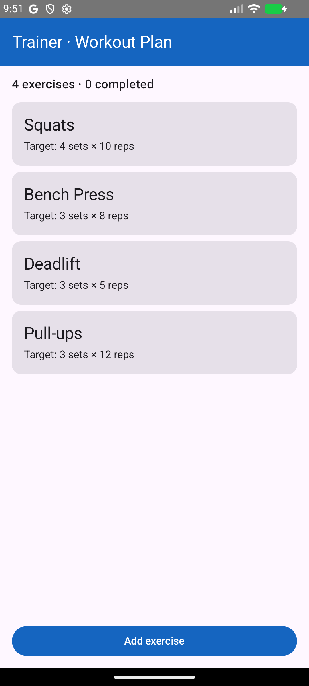
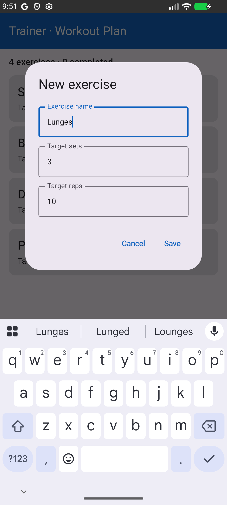
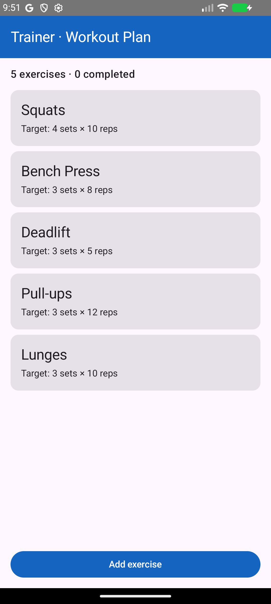
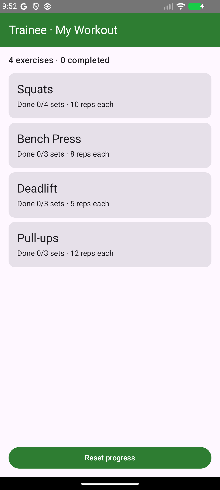
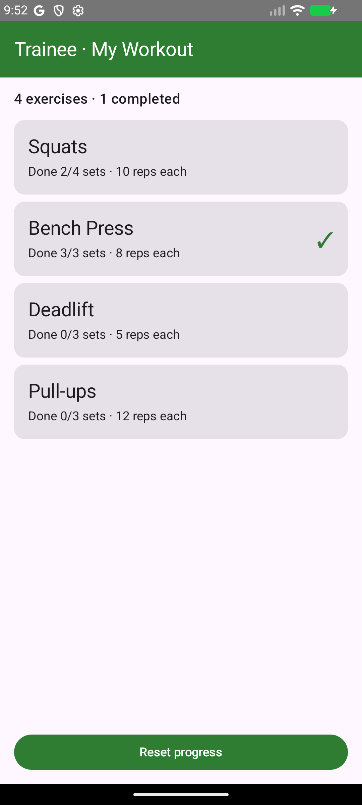

# Gym Workout Tracker — Exercise 1 (Android)

Two Android applications that share one common Android library module, built
with **Jetpack Compose + Material 3**. The shared module contains an
**abstract Activity** (`BaseWorkoutActivity`), and each app has a concrete
Activity that **inherits** from it — exactly the structure required by the
assignment.

## Modules

| Module     | Type                | Role |
|------------|---------------------|------|
| `:shared`  | `com.android.library` | Abstract `BaseWorkoutActivity`, the shared `WorkoutScreen` composable + `WorkoutTheme`, the `Exercise` model and the `WorkoutRepository` (SharedPreferences persistence). |
| `:trainer` | `com.android.application` | **Gym Trainer** app. `TrainerActivity : BaseWorkoutActivity`. Build the plan: add / edit / delete exercises and their target sets × reps. |
| `:trainee` | `com.android.application` | **Gym Trainee** app. `TraineeActivity : BaseWorkoutActivity`. Perform the plan: tap a card to log a set, reset progress with the button. |

## How the inheritance works

`BaseWorkoutActivity` (a `ComponentActivity`) owns everything common to both
screens — loading the plan, the observable Compose state, the theme, the
shared `WorkoutScreen` and saving. It declares hooks the subclasses override:

```
screenTitle()        -> top app bar title
actionLabel()        -> bottom button text
onActionClicked()    -> what the bottom button does
onExerciseClicked()  -> what a card tap does
describeExercise()   -> the secondary line under each exercise
emptyHint()          -> optional empty-state text
accentColor()        -> app accent colour (blue trainer / green trainee)
OverlayContent()     -> optional extra UI (trainer's add/edit dialog)
```

The **same** base class therefore renders and behaves completely differently
in the two apps just by overriding those hooks — that is the point of the
abstract Activity.

## Tech stack

| Layer | Technology |
|-------|-----------|
| UI | Jetpack Compose + Material 3 |
| Shared screen | `WorkoutScreen` composable in `:shared` |
| Persistence | SharedPreferences (JSON) via `WorkoutRepository` |
| Min / Compile SDK | 24 / 34 |
| Language | Kotlin |

## Screens

### Gym Trainer (blue) — build the plan
| Plan | Add exercise | After adding |
|------|--------------|--------------|
|  |  |  |

### Gym Trainee (green) — perform the plan
| Workout | Logging progress |
|---------|------------------|
|  |  |

## Demo videos

Screen recordings of both apps are in [`docs/video/`](docs/video):
`trainer_demo.mp4` and `trainee_demo.mp4`.

## Run it

1. Open the project root in **Android Studio** (it bundles a JDK 17+).
2. Let Gradle sync.
3. Pick the `trainer` run configuration → Run on an emulator/device.
4. Pick the `trainee` run configuration → Run. Both can be installed at once
   (different application IDs).

Or from the command line (needs JDK 17+):

```bash
./gradlew :trainer:assembleDebug :trainee:assembleDebug
```

APKs land in `trainer/build/outputs/apk/debug/` and
`trainee/build/outputs/apk/debug/`.

## Note on shared data

Each app runs in its own Android sandbox, so they keep independent copies of
the plan (both seeded with the same default workout). True cross-app sync
would need a `ContentProvider` or a backend — out of scope for this exercise.
